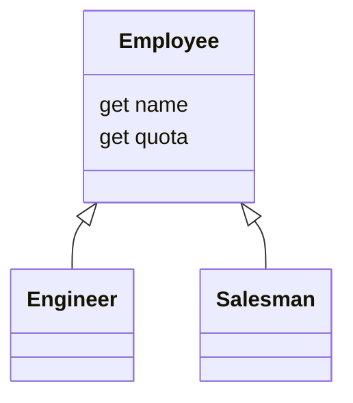

[](https://github.com/kaiosilveira/push-down-method-refactoring/actions/workflows/ci.yml)

ℹ️ _This repository is part of my Refactoring catalog based on Fowler's book with the same title. Please see [kaiosilveira/refactoring](https://github.com/kaiosilveira/refactoring) for more details._

---

# Push Down Method

<table>
<thead>
<th>Before</th>
<th>After</th>
</thead>
<tbody>
<tr>
<td>

```typescript
class Employee {
  get quota() { ... }
}

class Engineer extends Employee { ... }
class Salesman extends Employee { ... }
```

</td>

<td>

```javascript
class Employee { ... }
class Engineer extends Employee { ... }
class Salesman extends Employee {
  get quota() { ... }
}
```

</td>
</tr>
</tbody>
</table>

**Inverse of: [Pull Up Method](https://github.com/kaiosilveira/pull-up-method-refactoring)**

As it often happens with class hierarchies, we have some specific methods that was firstly thought to be common to all subclasses, but end up being relevant just for some of those. This refactoring gives a glimpse of what to do in these cases.

## Working example

Our working example is a straightforward `Employee` class hierarchy:



Our goal is to move the `quota` getter down to `Salesman`, since it's only used there.

### Test suite

Our test suite covers the basic properties of `Salesman`:

```javascript
describe('Salesman', () => {
  it('should have a name', () => {
    const salesman = new Salesman('Kaio');
    expect(salesman.name).toBe('Kaio');
  });

  it('should have a quota', () => {
    const salesman = new Salesman('Kaio');
    expect(salesman.quota).toBe(1.5);
  });
});
```

That's the minimum we need in place to get going.

### Steps

We start by copying the `quota` getter into `Salesman`:

```diff
diff -- gift Salesman...
+
+  get quota() {
+    return this._quota;
+  }
 }
```

then we remove `quota` from `Employee`:

```diff
diff --git Employee...
-
-  get quota() {
-    return this._quota;
-  }
 }
```

And that's it!

### Commit history

Below there's the commit history for the steps detailed above.

| Commit SHA                                                                                                              | Message                               |
| ----------------------------------------------------------------------------------------------------------------------- | ------------------------------------- |
| [55ea287](https://github.com/kaiosilveira/push-down-method-refactoring/commit/55ea287edd9cc5439ac754ef648482937557fcbe) | copy `quota` getter to `Salesman`     |
| [93341da](https://github.com/kaiosilveira/push-down-method-refactoring/commit/93341da4e3334773aa6b50c9241550e716bd62d5) | remove `quota` getter from `Employee` |

For the full commit history for this project, check the [Commit History tab](https://github.com/kaiosilveira/push-down-method-refactoring/commits/main).
